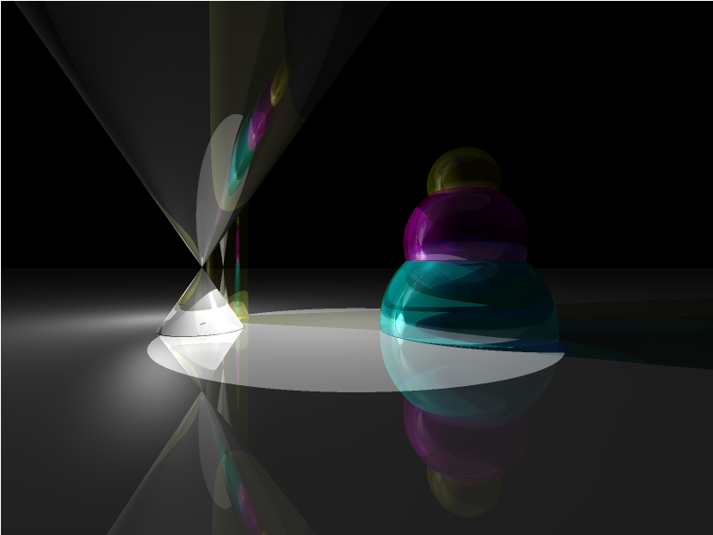
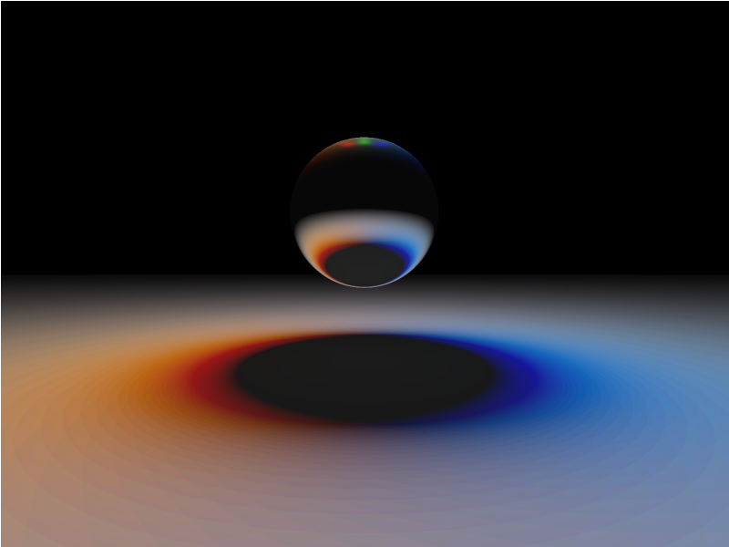
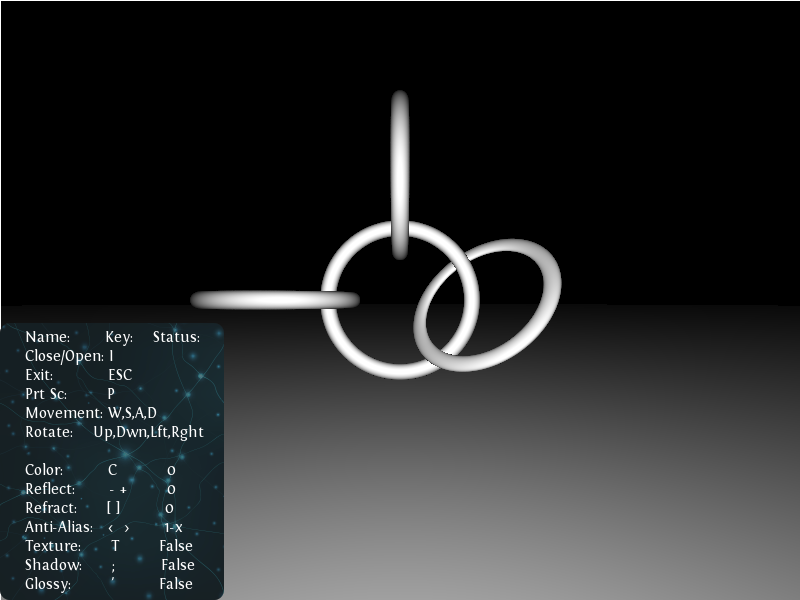
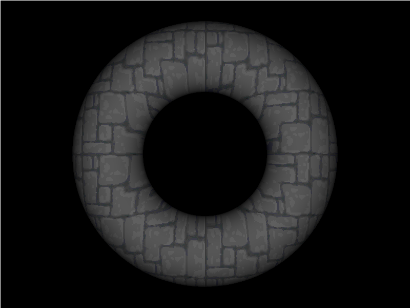

# RT - 42/Unit Factory

This group project create program, which emulate Ray Tracing technology.
Look video how it works: https://www.youtube.com/watch?v=zxsZMYd8WYQ

# Authors:
- mvlad
- vholovin
- vpalyvod
- vvlasenk

# Features:
- C + POSIX Threads + cJSON + SDL2
- Multithread using pthreads
- All scene data serialized of cJSON
- SDL2 used for interactive mode and for out information display

# Objects:
- Sphere
- Infinity Plane
- Infinity Cylinder
- Infinity Cone
- Ellipsoid
- Paraboloid
- Torus
- Disc
- Triangle
- Limited Plane

# Camera:
- Angle of view
- Rotate direction
- Movement regardless of axes

# Ray Tracing:
- Multisampling for antialiasing
- Ambient, point, direct and parralel lights
- Lambert lighting model
- Mirror and gloss reflections (Fong's model)
- Reflection and refraction of rays (with Fresnel's law)
- Index (%) of reflection and transparency
- Refraction with refractive indexes
- Attenuation by transparent objects (with Beer's law)
- Shadows depend from transparency and color of objects
- Cartoon effect, B&W and Sepia

# Texture mapping:
- All objects have UV mapping
- Stretch and compress textures
- Shift textures on an objects
- Loading textures from PNG, BMP and JPG

# CONTROLS:
- '`esc`' - Exit
- '`I`' - Open/Close gui window
- '`P`' - Print Screen

# Movement camera:
- '`W`' - forward
- '`S`' - back
- '`A`' - left
- '`D`' - right

# Rotate camera:
- '`up`' - Up
- '`down`' - Down
- '`left`' - Left
- '`right`' - Righ

# Render flags:
- '`C`' - Change color (None, Cartoon, B&W, Sepia)
- '`-`', '`+`' - Change number of reflect
- '`[`', '`]`' - Change number of refract
- '`<`', '`>`' - Change number of Antialiasing
- '`T`' - Show/Hide texture
- '`;`' - Show/Hide shadow
- '`'`' - Show/Hide glossy
